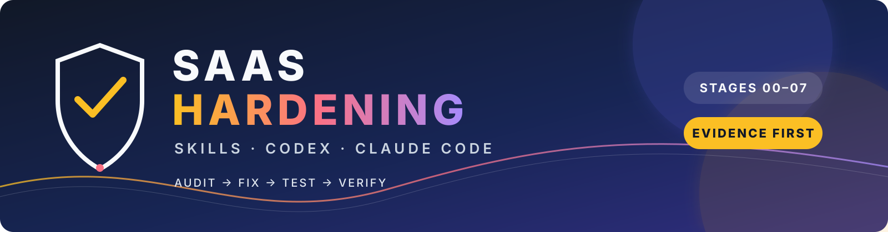

# SaaS Hardening Skills

<p align="center">
  
</p>

<p align="center">
  <a href="https://github.com/tiberiolemes/saas-hardening-skills"></a>
  <a href="LICENSE"></a>
  
  
  
</p>

<p align="center"><a href="#pt-br">🇧🇷 PT-BR</a> · <a href="#english">🇺🇸 English</a></p>

## PT-BR

Versão 1.1.0 · Licença MIT

Um framework baseado em evidências e organizado em etapas para o Codex e o Claude Code revisarem e fortalecerem aplicações SaaS existentes nas áreas de segurança, multi-tenancy, integridade de banco de dados, saúde do código, performance, UX, acessibilidade e prontidão para produção.

Este repositório contém nove Skills composáveis. A `saas-hardening-orchestrator` é o ponto de entrada controlado para um programa completo; os oito auditores também podem ser invocados individualmente. As mesmas Skills e referências são compartilhadas entre Codex e Claude Code, mantendo separados os metadados e subagentes específicos de cada plataforma.

### O que é — e o que não é

Este é um framework de fluxo de trabalho, não um scanner de vulnerabilidades nem uma garantia de que uma aplicação é segura. Ele orienta o agente a inspecionar o código real, preservar evidências, fazer mudanças proporcionais quando autorizadas, executar verificações relevantes e registrar o que continua sem verificação.

O framework é agnóstico à stack e se adapta à linguagem, ao framework, ao banco de dados, ao provedor de hospedagem e ao modelo de deploy da aplicação.

### Skills

| Etapa | Skill | Responsabilidade |
|---:|---|---|
| 00 | `saas-baseline` | Mapear arquitetura, fluxos, dados, tenancy, controles e verificações atuais antes de alterar o código. |
| 01 | `appsec-auditor` | Revisar autenticação, autorização, entradas, ameaças web, secrets, dependências e controles contra abuso. |
| 02 | `tenant-isolation-auditor` | Verificar propriedade de tenant/recurso, autorização no servidor, RLS, caminhos privilegiados e acesso entre tenants. |
| 03 | `database-integrity-auditor` | Revisar schema, constraints, migrations, queries, transações, concorrência e segurança dos dados. |
| 04 | `code-health-auditor` | Remover código morto comprovado, reduzir complexidade, melhorar manutenção e fortalecer testes relevantes. |
| 05 | `performance-auditor` | Medir e melhorar performance de backend e frontend sem comprometer correção ou isolamento. |
| 06 | `ux-accessibility-auditor` | Revisar jornadas críticas, feedback, recuperação de erros, responsividade e acessibilidade orientada a WCAG. |
| 07 | `production-readiness-auditor` | Revisar configuração, observabilidade, releases, resiliência, backups, recuperação e operação. |
| — | `saas-hardening-orchestrator` | Controlar a sequência 00–07, gates, evidências, status, checkpoints, commits e retomada. |

### Instalação

#### Codex

```text
$skill-installer

Install all Skills from tiberiolemes/saas-hardening-skills under the skills/ directory, including saas-hardening-orchestrator.
```

Para instalar em um projeto:

```bash
git clone https://github.com/tiberiolemes/saas-hardening-skills.git
mkdir -p /caminho/para/sua-aplicacao/.agents/skills
cp -R saas-hardening-skills/skills/* /caminho/para/sua-aplicacao/.agents/skills/
```

#### Claude Code

```bash
git clone https://github.com/tiberiolemes/saas-hardening-skills.git
claude --plugin-dir /caminho/para/saas-hardening-skills
```

Invoque o programa completo com `/saas-hardening-skills:saas-hardening-orchestrator`. Os subagentes ficam disponíveis pela interface `@` do Claude Code. Consulte [docs/claude-code.md](docs/claude-code.md) para detalhes.

### Uso e metodologia

Depois do baseline somente leitura, os stages 01–07 devem classificar findings, implementar correções seguras e autorizadas, testar cada mudança, executar caminhos adversariais quando aplicável e registrar evidências antes de marcar um finding como `RESOLVED`.

```text
CHECKPOINT → AUDIT → PLAN → FIX → TEST → ADVERSARIAL TEST → VERIFY → REPORT → GATE → COMMIT
```

O Stage 00 é somente descoberta. Findings que não puderem ser corrigidos com segurança ou clareza permanecem como `ACCEPTED`, `BLOCKED` ou `NOT_VERIFIED`, com o motivo e a próxima ação documentados. A etapa seguinte não começa enquanto a atual estiver `BLOCKED`.

O framework mantém:

```text
docs/audit/00-baseline.md
docs/audit/01-appsec.md
docs/audit/02-tenant-isolation.md
docs/audit/03-database.md
docs/audit/04-code-health.md
docs/audit/05-performance.md
docs/audit/06-ux-accessibility.md
docs/audit/07-production-readiness.md
docs/audit/AUDIT-STATUS.md
```

### Quality gates, Git e validação

Os gates exigem evidências, testes relevantes, caminhos negativos quando aplicável, diff revisado sem secrets ou mudanças não relacionadas, relatório e `AUDIT-STATUS.md` atualizados e commit lógico quando autorizado. Preserve o trabalho existente e nunca use `git reset --hard`, `git clean -fd`, force push ou operações destrutivas não aprovadas.

```bash
python3 scripts/validate_skills.py
```

Leia [CONTRIBUTING.md](CONTRIBUTING.md) antes de abrir um pull request. O framework é distribuído sob a [Licença MIT](LICENSE).

## English

Version 1.1.0 · MIT licensed

An evidence-based, staged framework of Skills for Codex and Claude Code to review and harden existing SaaS applications across security, multi-tenancy, database integrity, code health, performance, UX, accessibility, and production readiness.

This repository contains nine composable Skills. The `saas-hardening-orchestrator` is the controlled entry point for a complete program; the eight auditors can also be invoked independently for a scoped review. The same Skills and references are packaged for Codex and Claude Code, with platform-specific metadata and subagents kept separate.

## What this is — and is not

This is a workflow framework, not a vulnerability scanner or a guarantee that an application is secure. It guides Codex to inspect the actual codebase, preserve evidence, make proportionate changes when authorized, run relevant checks, and record what remains unverified.

The framework is intentionally stack-agnostic. It adapts to the application's language, framework, database, hosting provider, and deployment model instead of assuming a particular SaaS stack.

## Skills

| Stage | Skill | Responsibility |
|---:|---|---|
| 00 | `saas-baseline` | Map architecture, flows, data, tenancy, controls, and current checks before changing code. |
| 01 | `appsec-auditor` | Review authentication, authorization, input handling, web threats, secrets, dependencies, and abuse controls. |
| 02 | `tenant-isolation-auditor` | Verify tenant/resource ownership, server-side authorization, RLS, privileged paths, and cross-tenant resistance. |
| 03 | `database-integrity-auditor` | Review schema, constraints, migrations, queries, transactions, concurrency, and data safety. |
| 04 | `code-health-auditor` | Remove proven dead code, reduce unnecessary complexity, improve maintainability, and strengthen relevant tests. |
| 05 | `performance-auditor` | Measure and improve backend and frontend performance without trading away correctness or isolation. |
| 06 | `ux-accessibility-auditor` | Review critical journeys, feedback, error recovery, responsive behavior, and WCAG-oriented accessibility. |
| 07 | `production-readiness-auditor` | Review configuration, observability, release safety, resilience, backups, recovery, and operational readiness. |
| — | `saas-hardening-orchestrator` | Control the full 00–07 sequence, gates, evidence, status, checkpoints, commits, and resumption. |

## Installation

### Install with Codex

Install the orchestrator and the auditors you need with the built-in Skill Installer. For the complete framework, ask Codex:

```text
$skill-installer

Install all Skills from tiberiolemes/saas-hardening-skills under the skills/ directory, including saas-hardening-orchestrator.
```

If the installer asks for a specific path, use one of these directories:

```text
tiberiolemes/saas-hardening-skills/skills/saas-hardening-orchestrator
tiberiolemes/saas-hardening-skills/skills/appsec-auditor
tiberiolemes/saas-hardening-skills/skills/tenant-isolation-auditor
```

Restart Codex if a newly installed Skill does not appear. Skills can be invoked explicitly with `$skill-name`; automatic invocation remains enabled by default.

### Install into one project

Clone the repository and copy the selected Skill folders into the project-scoped discovery directory:

```bash
git clone https://github.com/tiberiolemes/saas-hardening-skills.git
mkdir -p /path/to/your-app/.agents/skills
cp -R saas-hardening-skills/skills/* /path/to/your-app/.agents/skills/
```

Run Codex from the application repository. Keep the framework repository separate from the application being audited.

### Install for personal use

For a user-wide installation, copy or symlink the selected Skill folders into the user Skill directory supported by your Codex installation, commonly `~/.agents/skills`. Prefer symlinks during development so updates can be tested before publishing a release.

### Install for Claude Code

Claude Code uses the same `skills/` layout and `SKILL.md` files, with a Claude plugin manifest and Markdown subagents at the repository root. See [docs/claude-code.md](docs/claude-code.md) for installation and invocation details.

For a quick local test after cloning:

```bash
claude --plugin-dir /path/to/saas-hardening-skills
```

Invoke the complete program with `/saas-hardening-skills:saas-hardening-orchestrator`. Specialist subagents are available through Claude Code's `@` mention interface.

## Usage

From the root of the SaaS application:

```text
Use $saas-hardening-orchestrator to run the complete 00–07 hardening program on this repository.
After the read-only baseline, implement safe and authorized corrections; test and verify each change, preserve existing work, do not expose secrets, and stop at any blocked quality gate.
```

The orchestrator creates or updates:

```text
docs/audit/00-baseline.md
docs/audit/01-appsec.md
docs/audit/02-tenant-isolation.md
docs/audit/03-database.md
docs/audit/04-code-health.md
docs/audit/05-performance.md
docs/audit/06-ux-accessibility.md
docs/audit/07-production-readiness.md
docs/audit/AUDIT-STATUS.md
```

For a focused review, invoke an auditor directly:

```text
Use $tenant-isolation-auditor to review authorization and cross-tenant access for the billing and export flows. Classify findings, implement safe authorized corrections, and verify them with evidence and negative-path tests.
```

To resume an interrupted program:

```text
Use $saas-hardening-orchestrator to resume from docs/audit/AUDIT-STATUS.md. Re-check the current commit, working tree, blockers, and the last completed gate before continuing.
```

## Methodology

The program has eight controlled stages:

```text
00 Baseline
   ↓
01 AppSec → 02 Tenant isolation → 03 Database integrity
   ↓
04 Code health → 05 Performance → 06 UX + accessibility
   ↓
07 Production readiness
```

Every stage follows the same evidence loop:

```text
CHECKPOINT → AUDIT → PLAN → FIX → TEST → ADVERSARIAL TEST → VERIFY → REPORT → GATE → COMMIT
```

The program is audit-and-remediation, not report-only. Stage 00 is read-only discovery. In stages 01–07, implement safe, proportionate, well-understood corrections within the user's authorization; do not mark findings resolved without verification evidence. Findings that cannot be safely or clearly changed remain `ACCEPTED`, `BLOCKED`, or `NOT_VERIFIED` with the reason and next action documented.

The next stage cannot begin when the current stage is `BLOCKED`. Findings use `P0`–`P3` severity, and every claim is marked with evidence, confidence, or `NOT_VERIFIED` when the repository does not prove it.

See [docs/methodology.md](docs/methodology.md), [docs/quality-gates.md](docs/quality-gates.md), and [docs/git-discipline.md](docs/git-discipline.md) for the human-facing operating contract.

Claude Code packaging details are in [docs/claude-code.md](docs/claude-code.md).

## Quality gates

The shared gate requires:

- no unresolved or unaccepted `P0` findings;
- no unresolved `P1` findings for the stage's required controls;
- relevant tests and checks executed with results recorded;
- adversarial or negative-path tests for security, authorization, tenancy, data, and API changes;
- a reviewed diff with no secrets, unrelated changes, or unexplained behavior changes;
- the stage report and `AUDIT-STATUS.md` updated;
- a logical commit when the task authorization and repository policy permit committing.

An absent check is not a pass. Use `NOT_VERIFIED` when evidence is unavailable, and `BLOCKED` when a required correction or decision prevents safe progress.

## Git discipline

The framework is designed for safe, reviewable work:

- inspect `git status`, the current branch, recent history, and the remote before changing files;
- preserve pre-existing user work and do not mix it into stage commits;
- never use `git reset --hard`, `git clean -fd`, force push, or an unapproved destructive database operation;
- review staged paths and scan for secrets before every commit or push;
- commit only after the applicable gate passes, with one logical commit per stage or coherent change set;
- never push automatically merely because a gate passed; pushing requires explicit user authorization.

## Validation

Validate the framework itself from its repository root:

```bash
python3 scripts/validate_skills.py
```

The repository should also be checked with the current Codex Skill validator (`quick_validate.py`) when available in the local installation. The validator checks frontmatter, names, and scaffold placeholders; it does not replace human review of workflow quality.

## Examples

More complete prompts and report examples are in [docs/examples.md](docs/examples.md).

### Full program

```text
Run the complete SaaS hardening program with $saas-hardening-orchestrator. First establish a read-only baseline. Then process stages 01–07 in order. At each stage, maintain the audit report and AUDIT-STATUS.md, classify findings P0–P3, implement safe authorized corrections, run applicable tests and negative paths, stop on a failed gate, and preserve all existing work.
```

### Security-only review

```text
Use $appsec-auditor for an evidence-based review of authentication, authorization, input handling, web threats, secrets, and dependency risk. Scope the review to the current application, implement safe authorized corrections after classification, and verify them with focused regression and adversarial tests.
```

### Gate review

```text
Use $saas-hardening-orchestrator to verify whether Stage 02 can be marked PASSED. Read the report, status file, diff, test results, and adversarial cases. Do not mark the gate passed if any required evidence is missing.
```

## Scope and safety

Only run the framework against systems and repositories you are authorized to inspect. It is not a substitute for a professional penetration test, code review, privacy assessment, incident response plan, or compliance certification. Redact credentials, personal data, and exploit details that are not needed for remediation.

## Contributing

Read [CONTRIBUTING.md](CONTRIBUTING.md) before opening a pull request. Changes should keep the entrypoint Skills concise, place conditional detail in focused references, and pass the framework validator.

## License

Released under the [MIT License](LICENSE).
